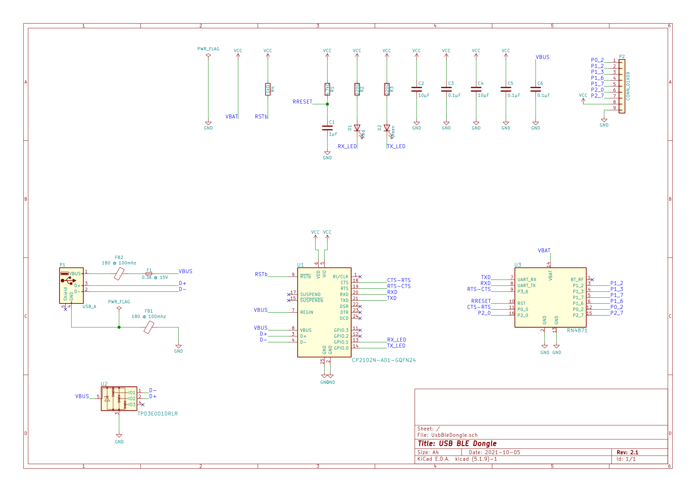

# Usb Ble Dongle

An RN4871 based usb dongle. The usb interface is implemented by a CP2102N USB-to-UART device.

## Features

* Bluetooth 5 Certified
* Easy to use ASCII command interface
* Module certified for use in USA, Canada, Brazil, Europe, Japan, Korea, Taiwan and China
* Supports LE Secure Connections levels 1-3
* Supports up to 151 byte payloads with Data Length Extensions
* Scripting features to allow for operation without a host microcontroller
* White list for determining connections
* MLDP compatibility with RN4020
* Remote configuration capability
* RX Sensitivity: -90 dBm
* TX Power: 0 dBm
* RSSI Monitor

## Schematic

## Connector Pins

Pin Number | Pin | Column C
---------|----------|---------
 1 | P0_2 | AD2,LED0: Provides indication whether the module is in On/Off mode.
 2 | P1_2 | GPIO; default: Input; pulled high,AD10; I2C SCL pin
 3 | P1_3 | GPIO; default: Input; pulled high,AD11; I2C SDA pin
 4 | P1_6 | Configurable pin
 5 | P1_7 | Configurable pin
 6 | P2_0 | System configuration input; 1: Application mode 0: Test mode/Flash update/EEPROM configuration Default: Input; pulled high.
 7 | P2_7 | UART_TX_IND output pin. Provides indication if RN4870 is transmitting to host MCU over UART. Pulled low before UART TX begins and pulled high after UART TX is over
 8 | +5 Volts | Connected to the Usb Vbus
 9 | Ground | COnnected to Usb Ground

## Additional Documentation

[RN4870/71 Data sheet](https://www.microchip.com/content/dam/mchp/documents/WSG/ProductDocuments/DataSheets/RN4870-71-Data-Sheet-DS50002489E.pdf)

[RN4870/71 Bluetooth Low Energy Module User's Guide](https://ww1.microchip.com/downloads/en/DeviceDoc/RN4870-71-Bluetooth-Low-Energy-Module-User-Guide-DS50002466C.pdf)

[Wiki](https://github.com/Axiologix-Technologies/Usb-Ble-Dongle/wiki)
